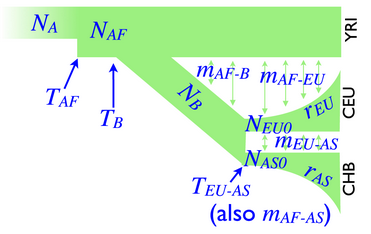
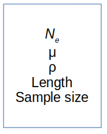
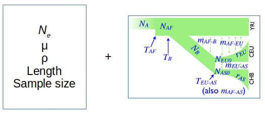
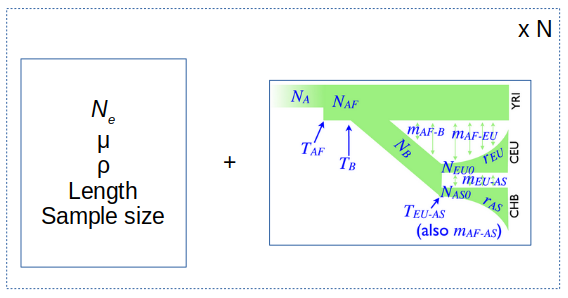

We are now interested in understanding whether such levels of differentiation are expected (or not) under neutral evolution.
We will assume we have a demographic model for the shared history of Africans, Europeans, East Asians, and Native Americans.
We are using the commonly used software [ms](http://home.uchicago.edu/rhudson1/source/mksamples.html) to perform coalescent simulations under neutrality.
Please follow the link to get the manual, if interested (but not required).

We also use a model previously estimated [here](http://journals.plos.org/plosgenetics/article?id=10.1371/journal.pgen.1000695) for the evolution of Africans, Europeans and East Asians.



Our goal here is to add the history of Native Americans to this model, roughly following estimates reported in [this](http://www.ncbi.nlm.nih.gov/pubmed/26198033) paper.
Thus, we will assume that Native Americans (their ancestors) splitted from East Asians 20kya and their effective population size is 2,000 from the split until present.

Please make sure to follow the preparatory instructions on the main page before running these examples.
```
MS=/ricco/data/matteo/Software/ms

DIR=/home/matteo/Copenhagen
```

----------------------------------------

Let us build the ms command that implements the previously mentioned model.
The basic command line consists of `ms nsam nreps -t theta`.



The first thing we need to define is how many samples we have (nsam, 80 chromosomes if we have 40 diploids) and how many repetitions we want (nreps, for instance 1,000).
Next we need to define the mutation parameter Theta which is equal to `4*Ne*mu*L` where:
* `Ne`: reference effective population size (7310, according to the model we are using)
* `mu`: mutation rate per bp per generation (2.35e-8, a bit outdated for humans but let us stick to the model used)
* `L`: length in bp of the simulated region (we have windows of 50kbp)

Similarly, we need to define a recombination rate parameter `-r rho length` (e.g. probability of recombination of 1.5e-8).

Therefore our basic command line would be:
```
$MS 80 1000 -t 34 -r 22 50000 | less -S
```
Look at the output file. Alleles are coded as 0 (ancestor) or 1 (derived).
Positions are relative to the length of the simulated region.

Then we need to define that we have 4 populations of 20 chromosomes each: `-I 4 20 20 20 20`.
The populations will be coded as 1 (African), 2 (European), 3 (East Asian), 4 (Native American).



Finally, we need to state how population sizes change in time, when they split and whether they exchange migrants (according to ms documentation):
* `-n i x` Set subpop i size to x at present
* `-en t i x` Set subpop i size to x*N0 at time t and growth rate to zero
* `-ej t i j` Move all lineages in subpopulation i to subpopulation j at time t (this is backward in time!)
* `-em t i j x` Set Mij (=4N0*mij) to x at time t. mij is the fraction of subpopulation i made up of migrants each generation from subpopulation j

As we said before, we are going to use a previously estimated model for populations 1-3 (adapted from [here](http://gutengroup.mcb.arizona.edu/Publications/Gutenkunst2009-Supp.pdf)):
```
-n 1 1.68 -n 2 3.73 -n 3 7.29 -n 4 ??? -eg 0 2 116 -eg 0 3 160 -ma x 0.88 0.56 0.00 0.88 x 2.79 0.00 0.56 2.79 x 0.00 0.00 0.00 0.00 x -ej 0.029 3 2 -en 0.029 2 0.29 -en 0.30 1 1 -ej ???
```

Therefore we need to set the following parameters:
* current effective population size in Native Americans `-n 4 ???`.

Assume that it is equal to 2,000. All population sizes are scaled to `Ne` reference, which here is equal to 7310.

**QUESTION**

Which value should you insert in `-n 4 ???`?

Think...

...

Think harder without looking at the solution below...

...


...


...

...

The solution is `2000/7310=0.24` so our command would be: `-n 4 0.24`.

* split event from East Asians (pop3) to Native Americans (pop4).
For this purpose we need to assume that this event happened 20,000 years ago and our generation time is 25 years.
All times are scaled in `4N0` generations.

How many generations are in 20,000 years, assuming a generation time of 25 years?

Then, divide this number by 4 times our reference Ne (7310).

**QUESTION**

What is the value we should specify for the split time?

Think...

...

...

...

...

Thus, our command would be: `... -n 4 0.24 ... -ej 0.027 4 3`.

Make sure you are in the same folder as yesterday. You should have a folder called `Results` in your current directory.



Our complete command line is:
```
$MS 80 1000 -t 34 -r 22 50000 -I 4 20 20 20 20 -n 1 1.68 -n 2 3.73 -n 3 7.29 -n 4 0.25 -eg 0 2 116 -eg 0 3 160 -ma x 0.88 0.56 0.00 0.88 x 2.79 0.00 0.56 2.79 x 0.00 0.00 0.00 0.00 x -ej 0.027 4 3 -ej 0.029 3 2 -en 0.029 2 0.29 -en 0.30 1 1 > Results/ALL.ms
```
Look at the results:
```
less -S Results/ALL.ms
```

------------------------------------------------------------------------

From these simulations, we now need to calculate summary statistics.
In other words, we want to retrieve the distribution of PBS under neutral evolution.
We are then going to test whether our observed value falls within or outside such distribution.


First, let's compute some summary statistics for each replication.
This may take a while with 1,000 repetitions. Launch it and have a coffee/cigarette/beer break.
```
Rscript $DIR/Scripts/ms2stats.R Results/ALL.ms > Results/ALL.ms.txt
```
Have a look at the output file (and check how many lines we have):
```
wc -l Results/ALL.ms.txt
less -S Results/ALL.ms.txt
```

Now we can plot the expected distribution of PBS under neutrality and assess whether our observed value (for instance the top PBS value) is higher than a specific percentile (e.g. 95th or 99th).
Replace `OBS` with the PBS you want to test for significance and plot the neutral distribution.
```
OBS=0.63
Rscript $DIR/Scripts/plotSim.R Results/ALL.ms.txt $OBS Results/NAM.pbs.hist.pdf
```
Inspect the plot:
```
evince Results/NAM.pbs.hist.pdf
```

**QUESTION**

What conclusions can we make? Can we reject the hypothesis of neutral evolution?

Next we are going to investigate the patterns of haplotype diversity around the EDAR region from high-depth sequencing data.

------------------------

[HOME](https://github.com/mfumagalli/Copenhagen)


